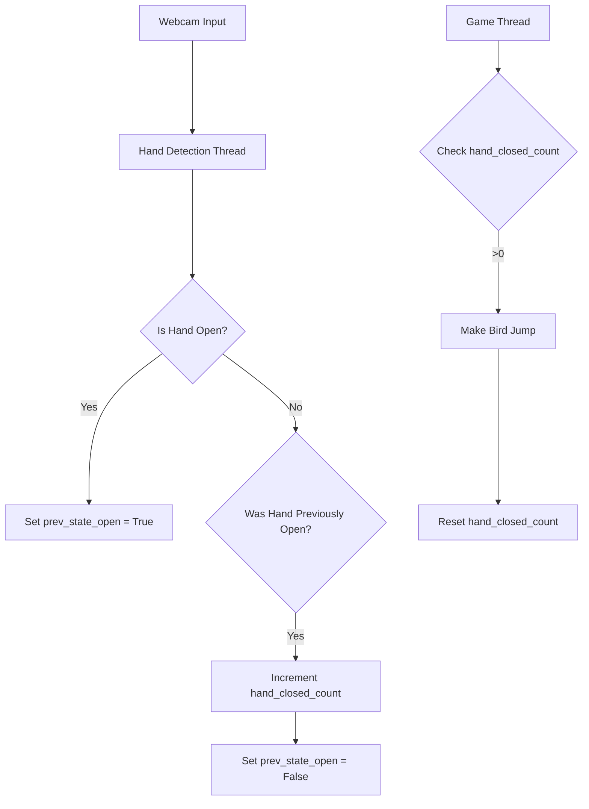

# Flappy Bird with Hand Gesture Control

I took assets from https://github.com/LeonMarqs/Flappy-bird-python | credit for him

install pygame, opencv-python, mediapipe


A Python implementation of Flappy Bird that uses hand gestures for control, combining computer vision with game mechanics to create an interactive gaming experience.

## Demo Video: https://www.linkedin.com/feed/update/urn:li:activity:7219526168079712258/

## Core Mechanism: Hand Detection & Game Integration

### Hand Detection System

#### 1. Hand Tracking Pipeline
```python
# Main components
cap = cv2.VideoCapture(0)        # Webcam capture
mpHands = mp.solutions.hands     # MediaPipe hand detection
hands = mpHands.Hands()          # Hand landmark detector
```

#### 2. Hand State Detection
The system determines if a hand is open or closed using these key steps:

1. **Landmark Detection**
   - Tracks 21 hand landmarks (points) in 3D space
   - Key points include fingertips (indices 4,8,12,16,20) and base points (0,5,9,13,17)

2. **Hand State Algorithm**
```python
def is_hand_open(landmarks):
    tips = [4, 8, 12, 16, 20]    # Fingertip indices
    bases = [0, 5, 9, 13, 17]    # Base point indices
    open_fingers = 0

    for tip, base in zip(tips, bases):
        distance = calculate_distance(landmarks.landmark[tip], landmarks.landmark[base])
        if distance > 0.1:        # Threshold for finger extension
            open_fingers += 1

    return open_fingers > 3       # Hand is "open" if 4+ fingers extended
```

### Game Integration Mechanism

#### 1. Threading Architecture
```python
# Global variables for cross-thread communication
hand_closed_count = 0            # Tracks hand close gestures
hand_prev_state_open = True      # Previous hand state
hand_detection_active = True     # Thread control flag

# Thread initialization
hand_detection_thread = threading.Thread(target=hand_detection)
hand_detection_thread.start()
```

#### 2. State Change Detection & Communication Flow



#### 3. Jump Integration Logic
```python
# In the game loop
if hand_closed_count > 0:
    bird.bump()                  # Trigger bird jump
    hand_closed_count = 0        # Reset counter
```

### How The Integration Works

1. **Continuous Monitoring**
   - Hand detection runs in a separate thread to prevent game lag
   - Continuously processes webcam frames at ~15-30 FPS
   - Updates hand state variables in real-time

2. **State Change Detection**
   - System maintains previous hand state
   - Only triggers when hand changes from open to closed
   - Prevents multiple triggers from a single gesture

3. **Cross-Thread Communication**
   - Uses `hand_closed_count` as a thread-safe signal
   - Game thread checks this value each frame
   - Zero latency between detection and game action

4. **Jump Mechanism**
   - When closed hand detected:
     ```python
     # In Bird class
     def bump(self):
         self.speed = -SPEED    # Negative speed creates upward movement
     ```

### Performance Considerations

1. **Thread Management**
   - Hand detection runs independently
   - Prevents video processing from blocking game updates
   - Ensures smooth gameplay even during detection

2. **State Reset**
   - `hand_closed_count` reset after each jump
   - Prevents multiple jumps from single gesture
   - Requires deliberate open-close motion for each jump

3. **Error Prevention**
   - Maintains thread safety for shared variables
   - Graceful cleanup on game exit
   ```python
   hand_detection_active = False
   hand_detection_thread.join()
   ```

## Tips for Implementation

1. **Camera Setup**
   - Position camera to capture clear hand view
   - Ensure consistent lighting
   - Maintain hand within frame bounds

2. **Gesture Calibration**
   - Adjust distance threshold (0.1) based on testing
   - May need tuning for different camera setups
   - Consider user's range of motion

3. **Performance Optimization**
   - Lower camera resolution if experiencing lag
   - Adjust processing frame rate if needed
   - Monitor CPU usage for both threads
